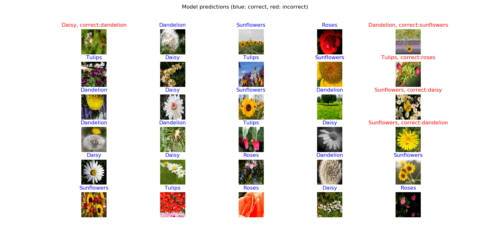

# [How to Use Transfer Learning for Image Classification using Keras in Python](https://www.thepythoncode.com/article/use-transfer-learning-for-image-flower-classification-keras-python)
To run this:
- `pip3 install -r requirements.txt`
- To train the model (already trained and the optimal weights are in `results` folder):
    ```
    python train.py
    ```
    This will load the flower dataset, construct the `MobileNetV2` model with its weights and starts training.
- 86% accuracy was achieved on 5 classes of flowers which are `daisy`, `dandelion`, `roses`, `sunflowers` and `tulips`.
- To evaluate the model as well as visualizing different flowers and its corresponding predictions:
    ```
    python test.py
    ```
    This will **Outputs:**
    ```
    23/23 [==============================] - 6s 264ms/step
    Val loss: 0.5659930361524
    Val Accuracy: 0.8166894659134987
    ```
    and **plots**:
    
    Check the [tutorial](https://www.thepythoncode.com/article/use-transfer-learning-for-image-flower-classification-keras-python) for more information.
