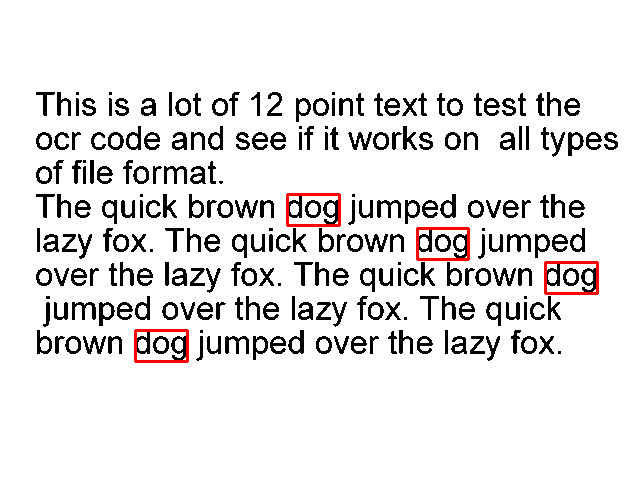

# [How to Recognize Optical Characters in Images in Python](https://www.thepythoncode.com/article/optical-character-recognition-pytesseract-python)
To run this:
- `pip3 install -r requirements.txt`
- If you want to recognize optical characters of the image `test.png`:
    ```
    python extracting_text.py test.png
    ```
    **Output:**
    ```
    This is a lot of 12 point text to test the
    ocr code and see if it works on all types
    of file format.

    The quick brown dog jumped over the
    lazy fox. The quick brown dog jumped
    over the lazy fox. The quick brown dog
    jumped over the lazy fox. The quick
    brown dog jumped over the lazy fox.
    ```
- for drawing boxes of the image `test.png` for the word `"dog"`:
    ```
    python draw-boxes.py test.png dog
    ```
    **Output:**

    
- For live camera, consider using `live_recognizer.py` script.

